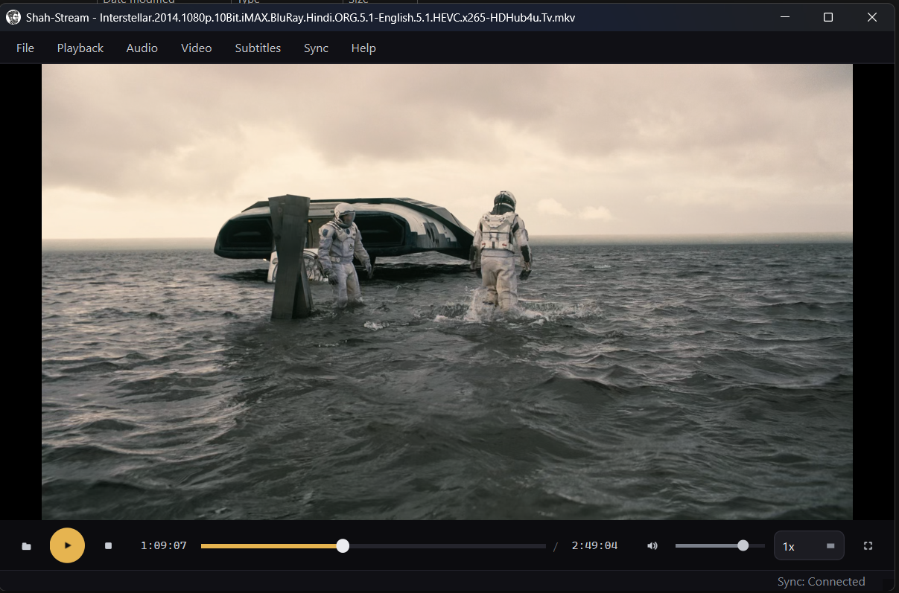

# Shah-Stream Pro 🎬



A professional Windows desktop media player built with **PyQt6** and **python-vlc** (libVLC). It features an advanced event-based **"watch together"** sync mode, allowing users to synchronize media playback across multiple clients using a room-based WebSocket protocol.

Whether you're playing local media offline or hosting a watch party with friends where play, pause, and seek actions are kept in perfect lockstep, Shah-Stream Pro has you covered!

---

## 🌟 Key Features

- **Offline Player Mode**: Play local video and audio files with full transport controls, subtitle selection, aspect-ratio switching, and playback rate adjustments. No internet connection needed.
- **"Watch Together" Sync Mode**: Connect to a server, join a room, and all actions (play, pause, seek, stop) are synchronized in real-time across all connected peers.
- **Echo Suppression**: Client actions are smartly broadcast and echo-suppressed to avoid playback jitter.
- **Clean UI & Shortcuts**: Built with a sleek PyQt6 interface, featuring a click-to-seek timeline and extensive keyboard shortcuts.

---

## 🏗️ Project Architecture

This repository is divided into two primary components:
1. **`stream-client/`**: The PyQt6 desktop application.
2. **`stream-server/`**: The Python WebSocket server handling the sync protocol.

---

## 🖥️ Client Setup (`stream-client`)

The client is a native desktop application. It requires the VLC media player to be installed on your system.

### Requirements
- **Windows** (primary target)
- **Python 3.10+**
- **VLC Desktop Application**: Matches your Python architecture (e.g., 64-bit Python requires 64-bit VLC). Download from [VideoLAN](https://www.videolan.org/vlc/).

### Installation & Running

```bash
cd stream-client

# 1. (Recommended) create and activate a virtual environment
python -m venv .venv
.venv\Scripts\activate

# 2. Install dependencies
pip install -r requirements.txt

# 3. Run the application
python main.py
```

*Note: You can configure the client by copying `.env.example` to `.env` and editing the `SHAH_SERVER_URL` and `SHAH_DEFAULT_ROOM`.*

---

## 📡 Server Setup (`stream-server`)

The sync server acts as a centralized WebSocket broker. It echoes every received message to all peers in the same room.

### Option 1: Running with Docker (Recommended)

The easiest way to run the server is using Docker and Docker Compose. This ensures the environment is perfectly isolated and ready to go.

```bash
cd stream-server

# Build and run the server using Docker Compose
docker-compose up --build -d
```
The server will now be listening on port `8765` (or whatever is configured in your `.env`).

### Option 2: Running Locally

If you prefer to run the server directly on your host machine:

```bash
cd stream-server
python -m venv .venv
.venv\Scripts\activate
pip install -r requirements-server.txt

python server.py
```

### Environment Variables
Configure the server by editing the `.env` file in the `stream-server` directory:
- `HOST`: Host IP to bind to (default `0.0.0.0`)
- `PORT`: Port to listen on (default `8765`)

---

## 🔌 WebSocket Sync Protocol

Sync uses a room-based JSON protocol over a single WebSocket connection. 

### Message Envelope
Every message is a JSON object containing:
- `type`: The action (`join`, `play`, `pause`, `seek`, `stop`, `sync`, etc.)
- `room`: The room name.
- `sender`: The display name of the client.
- `position_ms`: Playback position in milliseconds.
- `rate`: Playback rate (e.g., `1.0`).
- `msg_id`: Unique hex UUID for echo suppression.

### Synced Actions
When a user interacts with the player in sync mode, the client sends an action to the server, which broadcasts it to all peers in the room:
- **`play`**: Remotes seek to `position_ms`, then play.
- **`pause`**: Remotes seek to `position_ms`, then pause.
- **`seek`**: Remotes seek to `position_ms`.
- **`stop`**: Remotes stop playback.

---

## ⌨️ Keyboard Shortcuts (Client)

| Key            | Action                                   |
| -------------- | ---------------------------------------- |
| `Space`        | Play / pause toggle                      |
| `O`            | Open a media file                        |
| `F`            | Toggle fullscreen                        |
| `Esc`          | Exit fullscreen                          |
| `Left`         | Seek backward 5 seconds                  |
| `Right`        | Seek forward 5 seconds                   |
| `Up`           | Volume up (+5)                           |
| `Down`         | Volume down (−5)                         |
| `M`            | Toggle mute                              |
| Double-click   | Toggle fullscreen (on the video surface) |

---

## 📜 License
Provided as-is for the Shah-Stream Pro project.
